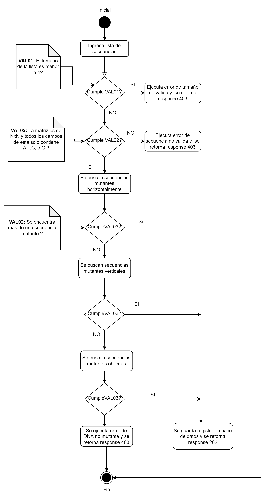

# xmen-app Challenge Mercado Libre

Este proyecto usa Quarkus como framework de desarrollo para Java ( https://quarkus.io/)
esta construido utilizando diferentes paradigmas de programacion como Programacion funcional,
Programacion reactiva y Programacion orientada a objetos.

Se utiliza Google App Engine para alojar el API desarrollada y una base de datos PostgreSQL.

Diagrama de actividades de la Validacion de la secuancia mutante:


Clases donde se realiza la validacion de la secuencia: 

- `XmenServiceImpl`
- `ValidationHorizontalSequenceImpl`
- `ValidationVerticalSequenceImpl`
- `ValidateObliqueSequencesImpl`


# API Endpoints
# Local
- Endpoint para validar si una secuencia ingresada es mutante:
```shell script
  POST - http://localhost:8080/mutant
  body : {
            "dna": ["AAAACG","CCCCGC","TTGTGT","AGAAGG","CTCCTA","TCACTG"]
         }
```

- Endpoint para obtener las estadisticas de los registros validados:
```shell script
  GET - http://localhost:8080/stats
```
# Google App Engine

- Endpoint para validar si una secuencia ingresada es mutante:
```shell script
  POST - https://xmen-validator.uc.r.appspot.com/mutant
  body : {
            "dna": ["AAAACG","CCCCGC","TTGTGT","AGAAGG","CTCCTA","TCACTG"]
         }
  ```

> **_NOTE:_**  Actualmente no se encuentra disponible el endpoint stats en app engine ya que no ha sido posible configurar
> el el driver reactivo para PostgreSQL en CloudSQL.

## Requisitos

Se necesita instalar los siguientes programas:
- Docker : https://docs.docker.com/engine/install/
- Cualquier SQL Client, se recomienda DBeaver(https://dbeaver.io/)

## Configuracion PostgreSQL en Docker

- Abrir una consola y ubicarse en la ruta `../xmen-app/devops/local/pgsql` ejecutar el comando siguente para instalar la imagen de PostgreSQL
```shell script
docker-compose up -d
```
- Conectarse a PostgreSQL con el SQL Client e ingresar el usuario y la contraseña `postgres`.
- Crear la base de datos `dnarecord`

## Correr la applicacion 

Correr la aplicación utilizando el comando:
```shell script
./mvnw compile quarkus:dev
```

> **_NOTE:_**  Se puede accerder a la interfaz de usuariode Quarkus en la ruta: http://localhost:8080/q/dev/.


